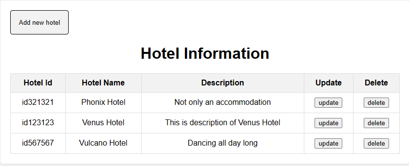
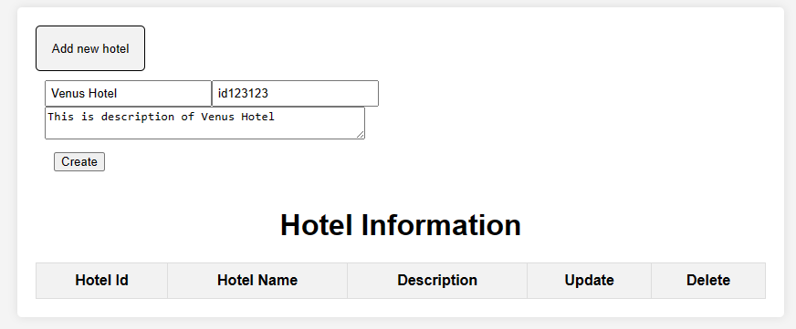
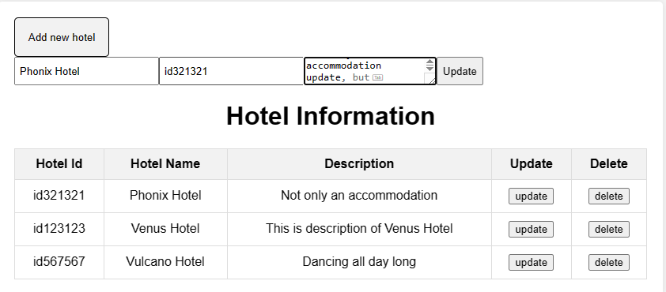
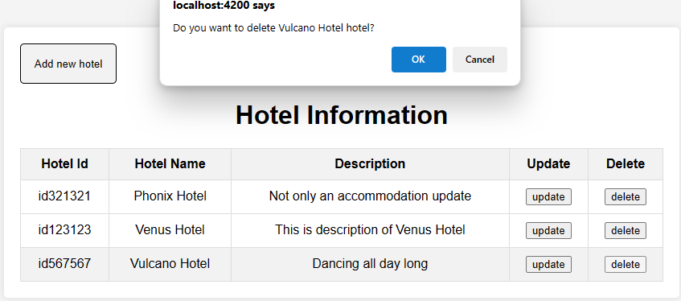

# Training

This project provides information and is a place to store the results of the training process for new interns

# DAY 3

We will manage a list of hotels, create APIs and store data into DynamoDB and display them on the frontend

Data for each hotel will include:

- Hotel id
- Name

## Setup DynamoDB

1. Install Docker
2. In your workspace, cd to `apps/backend` and create a new file `docker-compose.yml`
3. Composes it by run the cli: `docker-compose up`
4. Create a new file name `table-script.json` in `apps/backend/src` to define the attribute for a table in DynamoDB
5. Run DynamoDB by `docker run -p 8000:8000 amazon/dynamodb-local`
6. Add a table to database by run the aws cli `aws dynamodb create-table --cli-input-json file://table-script.json --endpoint-url http://localhost:8000`
7. You can check list of table by run `aws dynamodb list-tables --endpoint-url http://localhost:8000`

## Connect NestJS application with DynamoDB

1. In backend side, cd to the `main.ts` and add the `app.enableCors()` to allowing the frontend can connected
2. In your workspace run `npx nx serve backend` and `npx nx serve frontend` to starting application

## Frontend implement the API and show list hotel

- **Read**:
  - Method: GET
  - URL: `http://localhost:3000/api/hotel`
  - 
- **Create**:

  - Method: POST
  - URL:`http://localhost:3000/api/hotel`
  - Input: In Body enter `name` and `hotelId` and `description`

  - 

- **Update**:
  - Method: PUT
  - URL: `http://localhost:3000/api/hotel/:hotelId/:name`
  - 
- **Delete**
  - Method: DELETE
  - URL: `http://localhost:3000/api/:hotelId/:name`
  - 
